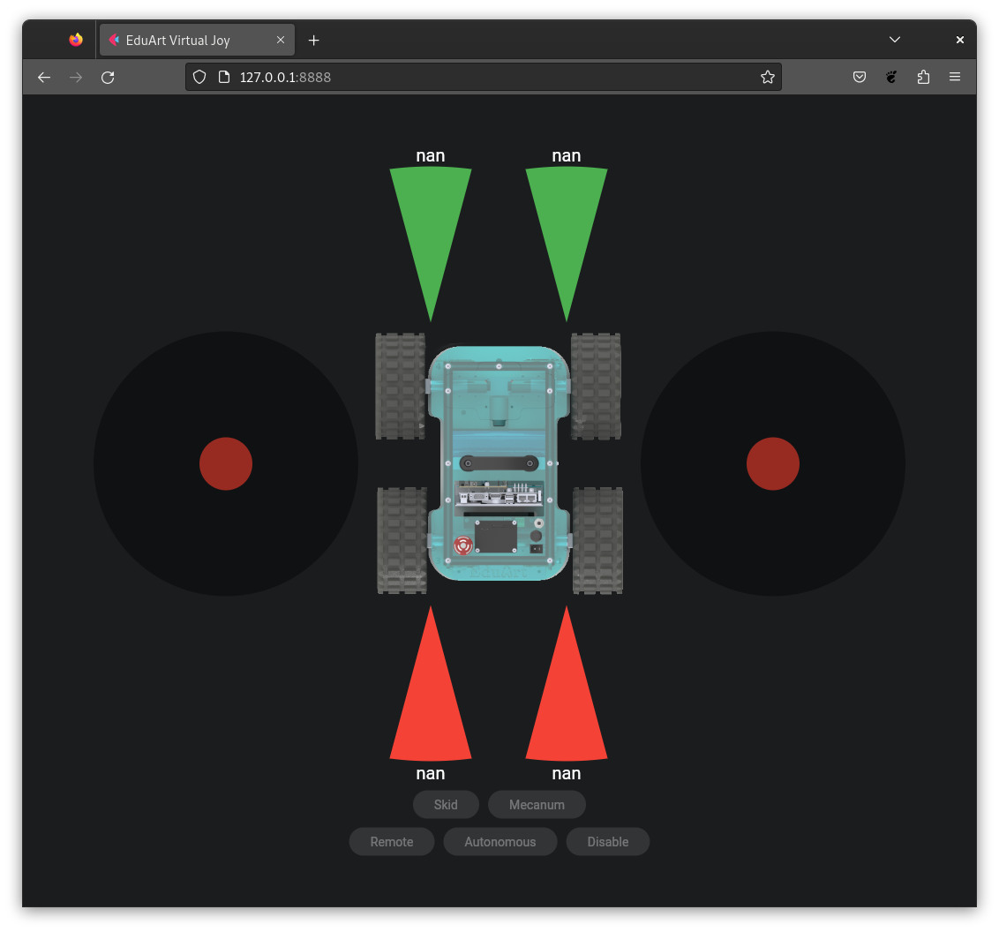
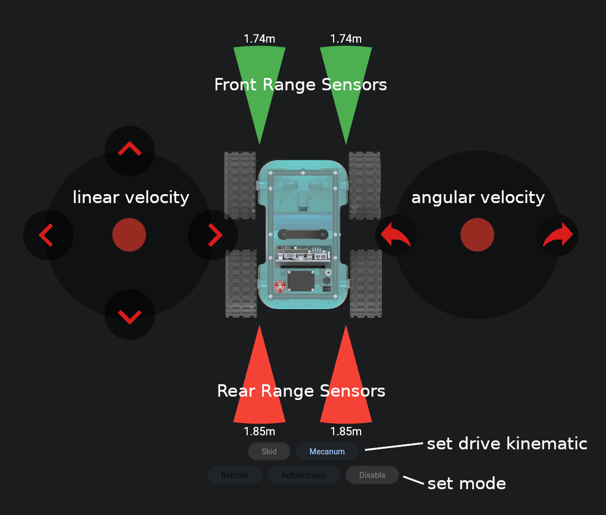

# edu_virtual_joy

This package provides a web server that can be used to control the robot Eduard from EduArt Robotik GmbH. The package comes with two ways to install. Either native or as a Docker image.



## Installation

### Docker Image

When using the Docker image, it is only necessary that the Docker Runtime is installed and the provided **docker_compose** file was downloaded. The Docker Runtime can be installed according to the [Docker Engine Install Instructions](https://github.com/EduArt-Robotik/edu_robot/blob/main/documentation/setup/iot2050/setup_iot2050.md#docker-engine).

For downloading the **docker_compose** file navigate to a preferred location and clone this repository using git:

```bash
git clone https://github.com/EduArt-Robotik/edu_virtual_joy.git
```

### Native ROS2 Package

As an alternative to the Docker image, there is an installation as a ROS2 package. This assumes that ROS2 is already installed. If this is not the case, please follow the [ROS Install Instructions](https://docs.ros.org/en/jazzy/Installation.html).

Please also make sure that you have "git" installed. If not:

```bash
sudo apt install git
```

Please navigate to your ROS2 workspace and into the **src** folder. Then clone the repository:

```bash
cd <your ros2 workspace>/src
git clone https://github.com/EduArt-Robotik/edu_virtual_joy.git
```

#### Requirements

Please make sure that **flet** is installed. This can be installed using pip. First install pip if it is not already installed.

```bash
sudo apt update
sudo apt install python3-pip
```

To build the packages you will need "colcon" install this as following:

```bash
sudo apt install python3-colcon-common-extensions
```

Also you need the jazzy diagnostic updater:

```bash
sudo apt install ros-jazzy-diagnostic-updater
```

You can then install **flet** with the following command:

```bash
pip3 install --user flet
```

This it required that the ROS2 package [edu_robot](https://github.com/EduArt-Robotik/edu_robot) is installed. If this is not the case, please clone it into the same ros2 workspace and build it:

```bash
cd <your ros2 workspace>/src
git clone https://github.com/EduArt-Robotik/edu_robot.git
cd ..
colcon build --packages-select edu_robot --event-handlers console_direct+ --symlink-install
```

#### Building

To build the the package please execute the **colcon** build command inside your workspace:

```bash
cd <your ros2 workspace>
colcon build --packages-select edu_virtual_joy --event-handlers console_direct+ --symlink-install
```

## Launching

The following instructions start the **virtual joy** application as a web server on port 1880. Before you start it, please note the environment variable **EDU_ROBOT_NAMESPACE**. This variable is used to separate robot interfaces, such as ros topics, from multiple robots connected to the same network.

The **EDU_ROBOT_NAMESPACE** must fit to the one used by the robot you want to control. Usually it was configure according this [Instructions](https://github.com/EduArt-Robotik/edu_robot/blob/main/documentation/setup/iot2050/setup_iot2050.md#prepare-environment) and looks like **eduard/blue** for example.

We assume that **edu_virtual_joy** is started on a normal PC and not on an EduArt robot. For this case, we define the **EDU_ROBOT_NAMESPACE** in each of the commands below to be more flexible to allow connection to different robots in the same network.

### Docker

>**Note**: it is assumed the robot namespace is **eduard/blue** in this case.

Navigate to the **edu_virtual_joy** folder, than into the folder containing the **docker compose** file:

```bash
cd <location of edu_virtual_joy>
cd docker/generic
EDU_ROBOT_NAMESPACE=eduard/blue docker compose up
```

>**Note**: If your user is not into the docker user group, a sudo is required.

### As ROS2 Package

>**Note**: it is assumed the robot namespace is **eduard/blue** in this case.

When your install folder was sourced you can run the **virtual joy** by executing:

```bash
ros2 run edu_virtual_joy virtual_joy --ros-args -r __ns:=/eduard/blue
```

## Controlling the Robot

Once the virtual joy web server has been launched, the UI can be accessed via a browser. Open a browser of your choice. If the virtual joy is running on the same computer, enter [http://127.0.0.1:8888](http://127.0.0.1:8888), otherwise enter the IP address of the computer together with port 8888.



### Set Mode

In the **set mode** row the current mode of the robot ths displayed. The gray "disabled" button indicates the current mode. The other buttons show the possible mode the robot can switch into it. If all three buttons are gray, this means either that the robot is charging and will not accept a new mode or that no data is being received from the robot.

If you want to set the robot to a new mode, press the corresponding button. When the robot has accepted the mode, this button turns gray.

### Set Drive Kinematic

In the **set drive kinematic** row the current set drive kinematic is displayed. The gray "disabled" button indicates the current selected drive kinematic.

To switch into new drive kinematic, press the corresponding button. When the robot has accepted the mode, this button turns gray.

### Controlling Velocity

If the robot is in mode **remote** controlled the velocity can be set by using the two joy sticks on the left and right. The left joystick controls the linear velocity in x and y direction. The right joystick controls the angular velocity around the z axis (yaw).

### Range Sensors

The measurements of the four range sensor, two front and two rear, are displayed. The current measured distance is printed next to the measuring cone.
